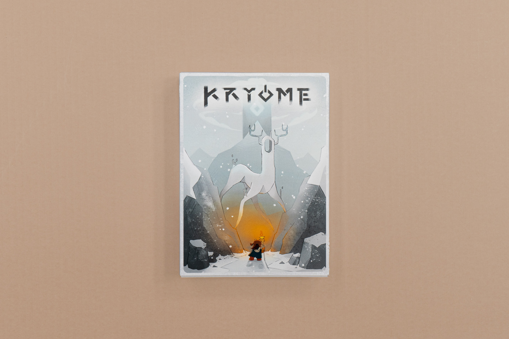
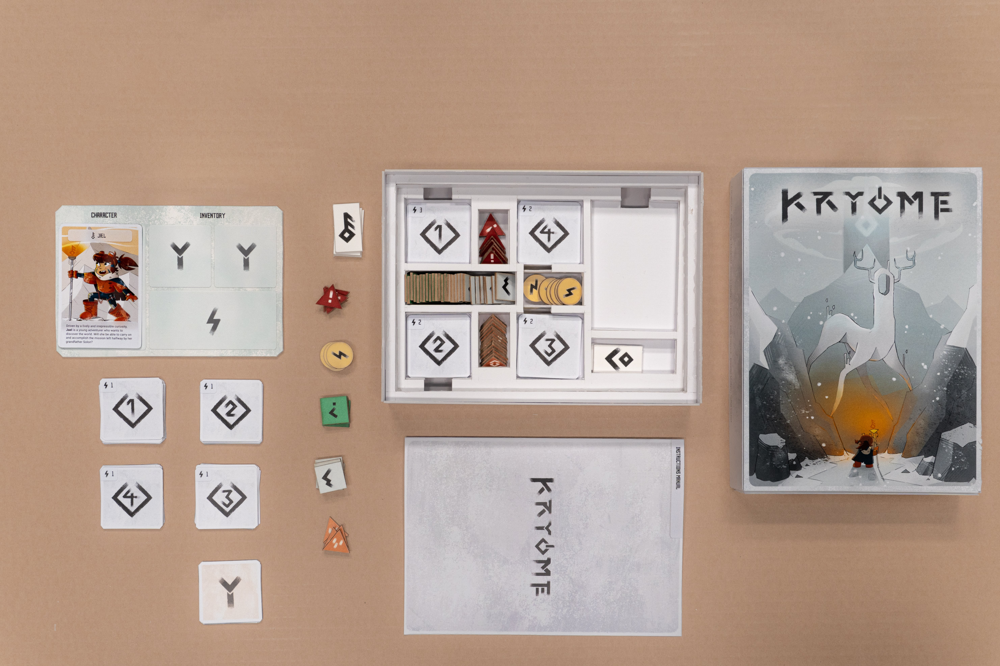
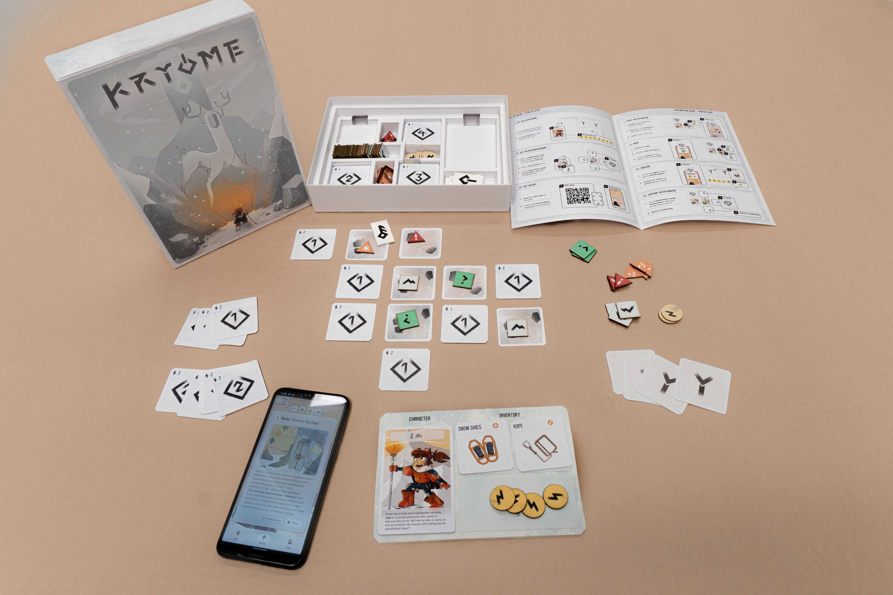
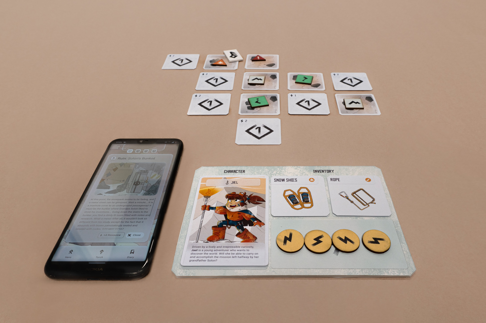
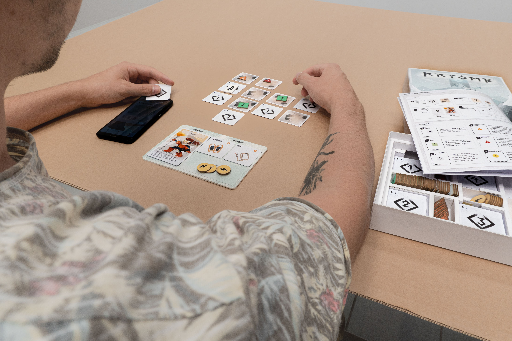

# Kryome
Webapp of a board game
###### ABSTRACT
Kryome is an exploration and adventure board game, in which a single player or multiple players must succeed in completing a quest by collecting items, exploring dungeons, solving puzzles, and interacting with other characters belonging to the narrative world. 
For this reason, Kryome is composed of both physical components – such as cards and tokens – and digital ones: more specifically, the physical game is supported by a mobile application that can be installed on a smartphone, through which cards can be scanned to manage the exploration of the world, find objects, and converse with the various characters one comes across while playing. 
Alongside the main, fixed mission on which the narrative is centered, players can then come across secondary narrative elements through free exploration of the world, which appears different with each playthrough, thus making each game experience unique.

###### AIM

In addition to goals related to the game experience, such as solving the main mission and the exploration component, Kryome aims to raise awareness with respect to the issue of access to Internet connectivity through ICT, as in the Sustainable Development Goal 17.8.

###### FULL PRESENTATION
https://bit.ly/39XUL1R

 
